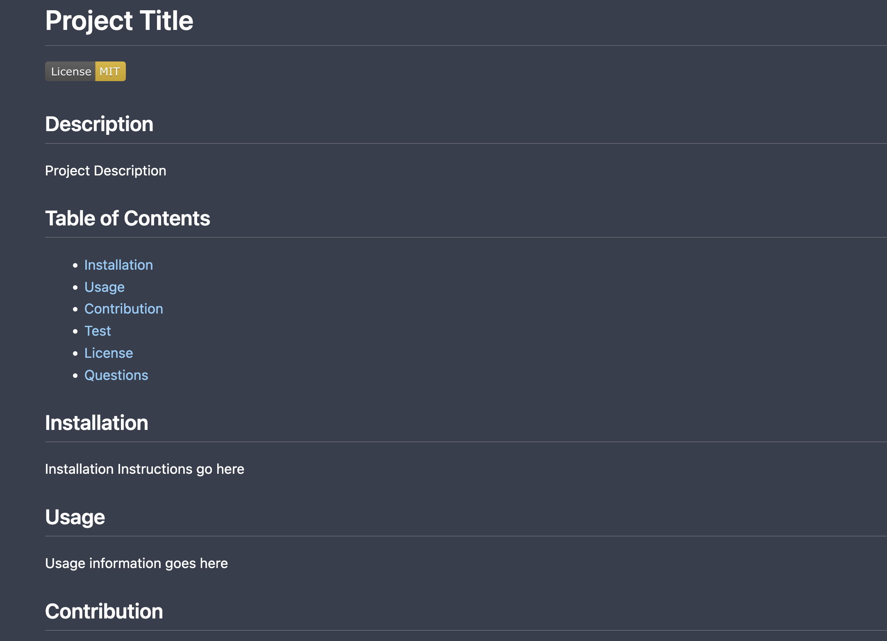
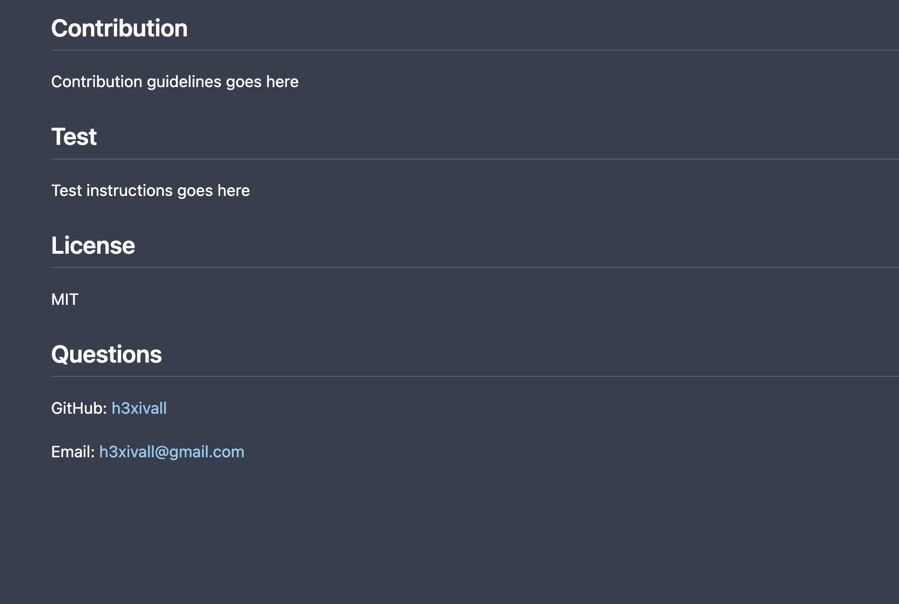

# README Generator

## Description

NodeJS app that utilizes the fs and inquirer modules to prompt the user questions and apply the answers in a structured format within a md file. When the file is created, it is named GeneratedREADME.md.

The prompt asks the users:

* Title
* Description
* Installation Instructions
* Usage Instructions
* Contribution Instructions
* Testing Instructions
* Desired License list to choose from [MIT, GNU GPLv3, Apache 2.0, ISC, None]
* GitHub Username
* Email Address

Then proceeds to generate a table of contents for each section, adds a license badge beneath the README title, and lists the GitHub profile link and email under the Questions section.

## Usage

Make sure you are within the main app directory and type:

```
node index.js
```

## Links

[GitHub](https://github.com/h3xivall)

[YouTube Demo](https://youtu.be/ClKC5sqrLb4)

## Screenshots


